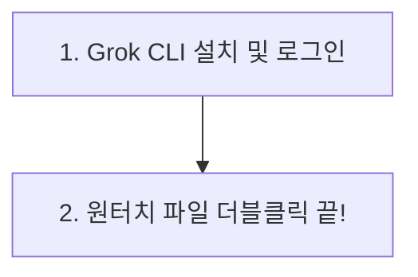

# 🎬 Grok Builder Video Generator (그록 빌더 비디오 제네레이터) 사용 설명서

안녕하세요! 이 프로젝트는 **x.ai의 Grok Imagine Video API**를 사용하여 멋진 AI 비디오를 만들 수 있게 해주는 개인용 비디오 제작 스튜디오입니다.

컴퓨터를 잘 다루지 못하는 분들도 **마우스 더블클릭 한 번**으로 Node.js 설치부터 웹페이지 띄우기까지 모든 과정을 자동으로 끝낼 수 있도록 최고의 편의 시스템을 만들었습니다! 😉

---

## 📌 전체적인 흐름 한눈에 보기
비디오 제작 스튜디오를 켜기 위해 우리가 거칠 단계는 딱 2가지로 끝납니다!



---

## 🔑 1단계: 그록(Grok) 로그인하기 (최초 1회)
이 프로그램은 사용자님이 컴퓨터 터미널에서 그록 로그인을 해 둔 안전한 세션 정보를 활용하여 비디오를 만듭니다. 딱 한 번만 로그인을 완료해 두면 됩니다.

### ① 터미널 프로그램 실행하기
*   **Mac(맥) 사용자**: 키보드의 `Command(⌘) + Space` 키를 동시에 누른 뒤, 나오는 검색창에 **Terminal** 또는 **터미널**을 타이핑하고 `Enter`를 쳐서 검은색 창(터미널)을 켭니다.
*   **Windows(윈도우) 사용자**: 키보드의 `Windows` 키를 누른 뒤 **cmd** 또는 **명령 프롬프트**를 입력하고 `Enter`를 쳐서 검은색 창을 켭니다.

### ② 딱 2줄만 복사해서 입력하세요
검은색 창에 아래의 명령어를 순서대로 복사하여 붙여넣고 `Enter`를 누릅니다.

1. **그록 프로그램 설치하기**:
   ```bash
   npm install -g @xai/grok-cli
   ```
2. **그록 로그인 실행하기**:
   ```bash
   grok login
   ```
   * *명령어를 입력하면 자동으로 인터넷 브라우저 창이 열립니다.*
   * *화면 안내에 따라 평소 사용하시는 그록(x.ai) 계정으로 로그인을 완료하세요.*
   * *터미널 창에 `You are logged in` 메시지가 나왔다면 로그인이 성공한 것입니다. 검은색 창은 닫으셔도 좋습니다!*

---

## 🚀 2단계: 원터치 파일 더블클릭하고 비디오 만들기! (끝)
이제 모든 복잡한 준비는 원터치 자동 실행 파일이 100% 알아서 해줍니다. 마우스 클릭만 하세요!

> [!TIP]
> ### 💡 더블클릭 한 번이 부리는 자동 마법:
> 1. 컴퓨터에 **Node.js**나 **npm**이 안 깔려 있다면, **컴퓨터에 맞는 공식 버전을 무음으로 알아서 무인 설치**해 줍니다!
> 2. 프로그램 실행에 필요한 부속 구성품을 완벽하게 자동 설치합니다.
> 3. 중계 서버 및 호스팅 서버를 병렬로 안전하게 기동합니다.
> 4. **서버가 켜지자마자 스스로 인터넷 창을 열어 비디오 생성 스튜디오 페이지(`http://localhost:5173`)를 눈앞에 띄워줍니다!**

### 💻 내 컴퓨터 환경에 맞춰 실행하세요:

*   **🍏 Mac (맥) / 🐧 Linux 사용자**:
    *   프로젝트 폴더 안에 있는 **`start.sh`** 파일을 마우스로 **더블클릭**하여 실행합니다.
    *   *(Mac OS 전용 실행 권한이 이미 완벽히 세팅되어 있어 곧바로 구동됩니다.)*
*   ** Windows 사용자**:
    *   프로젝트 폴더 안에 있는 **`start.bat`** 파일을 마우스로 **더블클릭**하여 실행합니다.

---

## ⚠️ ‼️ 중요 주의사항 (꼭 읽어주세요)

> [!WARNING]
> ### 🛑 비디오가 다 만들어질 때까지 인터넷 창이나 까만 창을 끄지 마세요!
> 비디오 생성은 백엔드에서 실시간 연동 처리 중인 상태입니다.
> *   **비디오 로딩 도중에 인터넷 브라우저 창이나 탭을 닫거나 새로고침을 하면 진행 중이던 비디오 생성이 통째로 취소됩니다.**
> *   실수로 창을 닫으려 할 경우, 저희가 적용한 **안전 이탈 방지 팝업**이 작동하여 데이터 유실을 방지해 줍니다. 비디오가 완성되어 나타날 때까지 기다려 주세요!
> *   또한, 실행 파일 더블클릭으로 켜진 **까만색 터미널 창** 역시 비디오 스튜디오의 심장(서버)이므로 스튜디오를 이용하시는 동안 절대 끄시면 안 됩니다!

---


