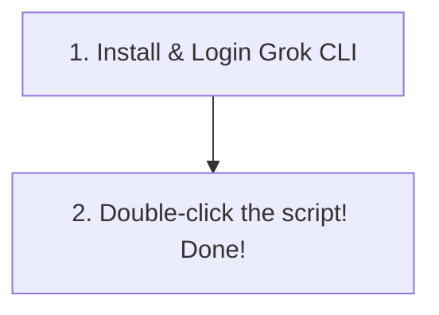

# 🎬 Grok Builder Video Generator - User Guide

Hello! This project is a premium personal video studio that allows you to easily create high-quality AI videos using **x.ai's Grok Imagine Video API**.

Even if you are not familiar with computers or terminal commands, you can automatically set up everything—from Node.js installation to launching the web studio—with **just a single double-click**! 😉

---

## 📌 Workflow at a Glance
Starting the video studio is incredibly simple and takes only 2 quick steps!



---

## 🔑 Step 1: Install & Login Grok CLI (First time only)
This program securely utilizes your local Grok login session to generate high-quality videos. You only need to complete this login once.

### ① Open your terminal program
*   **Mac Users**: Press `Command(⌘) + Space`, type **Terminal**, and press `Enter` to open the Terminal window.
*   **Windows Users**: Press the `Windows` key, type **cmd** or **Command Prompt**, and press `Enter`.

### ② Copy and paste these 2 commands
Type or paste the following commands sequentially into the command window and press `Enter`.

1. **Install Grok CLI**:
   ```bash
   npm install -g @xai/grok-cli
   ```
2. **Execute Grok Login**:
   ```bash
   grok login
   ```
   * *A web browser will open automatically.*
   * *Log in using your registered Grok (x.ai) credentials.*
   * *Once you see `You are logged in` in your terminal window, the login is successful! You may close the terminal.*

---

## 🚀 Step 2: Double-Click and Generate Your Videos! (Done)
From now on, our intelligent one-touch automated script handles 100% of the complicated setups for you. Just sit back and double-click!

> [!TIP]
> ### 💡 What the One-Touch Script Automates:
> 1. If **Node.js** or **npm** is not found on your system, **it silently downloads and installs Node.js automatically** based on your OS!
> 2. Automatically downloads all required project libraries and dependencies.
> 3. Launches the local bridge server and web interface concurrently.
> 4. **Once the server ports are active, it instantly opens your default web browser and navigates straight to the Video Generator Web Page (`http://localhost:5173`)!**

### 💻 Double-click the file suitable for your OS:

*   **🍏 Mac / 🐧 Linux Users**:
    *   Find the **`start.sh`** file in the project folder and **double-click** it.
    *   *(Optimized execution permissions are pre-configured for macOS, so it runs immediately.)*
*   ** Windows Users**:
    *   Find the **`start.bat`** file in the project folder and **double-click** it.

---

## ⚠️ ‼️ Critical Warnings (Please read carefully)

> [!WARNING]
> ### 🛑 Do not close the web browser or command windows while generating videos!
> The video generation is running live on the backend.
> *   **If you close the web browser tab or refresh the page during loading, the video generation will be aborted immediately, and your progress will be lost.**
> *   If you accidentally try to close the tab, our **exit-prevention warning popup** will alert you to protect your creation!
> *   Additionally, the **black command window** that opened is the server engine. Please keep it open and active while using the video studio!
